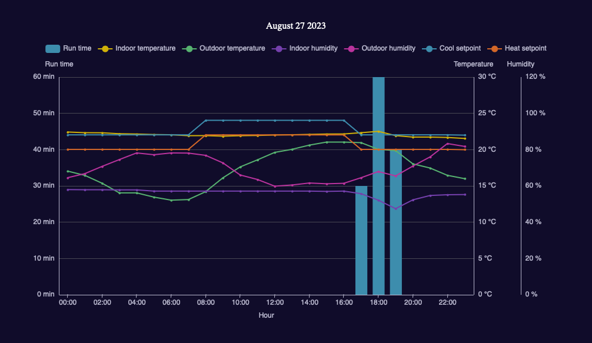

# Daikin One CLI

## Overview

Daikin One is a lightweight CLI wrapper for the [Daikin Open API](https://www.daikinone.com/openapi/index.html) to manage Daikin One devices/thermostats.

It is augmented with logging and reporting functionality to provide historical usage insights which is missing from Daikin One devices.



[View a sample report](https://redgoose.github.io/daikin-one/resources/sample_report.html)

## Quick Start

1. Install [Go](https://golang.org/doc/install)
2. Install `daikin-one`:

	```sh
	go install github.com/redgoose/daikin-one@latest
	```

3. Create a folder named `.daikin` in your home directory. Copy `config/daikin.yaml` to `.daikin/daikin.yaml` in your home directory and populate with your integrator token, api key, and email. Refer to the [getting started](https://www.daikinone.com/openapi/documentation/index.html#gettingstarted) section of the Daikin Open API documentation to get those values.


4. Get a device id for the device you want to manage:

	```sh
	daikin-one device ls
	```

	This will return a list of devices associated with your account:

	```json
	[
		{
			"locationName": "Home",
			"devices": [
				{
					"id": "0a000000-0000-00aa-00a0-0a00aa0a00aa",
					"name": "Main Room",
					"model": "ONEPLUS",
					"firmwareVersion": "3.2.19"
				}
			]
		}
	]
	```


5. With a device id, you can start managing your device. For example, to retrieve device configuration and state values use:

	```sh
	daikin-one device info --device-id <device-id>
	```

	This will output something like:

	```json
	{
		"coolSetpoint": 22,
		"heatSetpoint": 20,
		"fanCirculateSpeed": 0,
		"equipmentStatus": 5,
		"humOutdoor": 73,
		"tempIndoor": 21.8,
		"setpointDelta": 2,
		"equipmentCommunication": 0,
		"modeEmHeatAvailable": true,
		"geofencingEnabled": true,
		"scheduleEnabled": true,
		"humIndoor": 57,
		"modeLimit": 1,
		"setpointMinimum": 10,
		"fan": 0,
		"tempOutdoor": 21,
		"mode": 2,
		"setpointMaximum": 32
	}
	```

	Refer to the Daikin Open API [data definitions](https://www.daikinone.com/openapi/documentation/index.html#datadefinitions) for information on fields and possible values.

Run `daikin-one -h` and `daikin-one device -h` for a full list of available commands.

## Logging

1. Copy `config/daikin.db` to `.daikin/daikin.db` in your home directory.
2. Run the following to start logging:
	```sh
	daikin-one log -d <device-id>
	```

	This will log your device data to the local SQLite database every 5 minutes.

Ideally you run this using your operating system's service manager. ie. Using Ubuntu's systemd, an example `daikin_one.service` file would look like:

```ini
[Unit]
Description=daikin one

[Service]
User=foo
Group=foo
ExecStart=/home/foo/go/bin/daikin-one log -d <device-id>

[Install]
WantedBy=multi-user.target
```

## Reports

Prerequisites:
* Populate `temperatureUnit` in your  `$HOME/.daikin/daikin.yaml` file.
* Ensure sufficient data has been logged via the `log` command.

### Report Summary

The report summary command will output an HTML report consisting of charts for the last 7 days, current month, and current year to `stdout`.

```sh
daikin-one report summary -d <device-id>
```

To output the report to a file instead, use:

```sh
daikin-one report summary -d <device-id> > report_summary.html
```

### Specific Day/Month/Year Reports

If the report summary doesn't include charts for the dates you're interested in, you can generate reports for a specific day/month/year as follows:

```sh
daikin-one report day 2023-08-19 -d <device-id> > report_day.html
daikin-one report month 2023-08 -d <device-id> > report_month.html
daikin-one report year 2023 -d <device-id> > report_year.html
```

## License

MIT © redgoose, see [LICENSE](https://github.com/redgoose/daikin-one/blob/master/LICENSE) for details.
